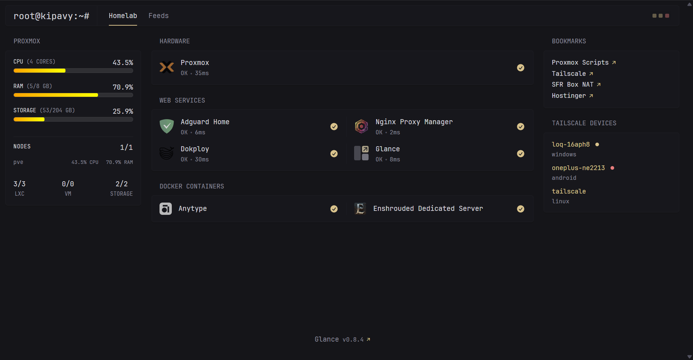

1. Install Glance template on Dokploy or using https://community-scripts.github.io/ProxmoxVE/scripts?id=glance
2. provide following env variables in dokploy or in `/opt/glance/.env` for Proxmox VE Script deployment:
    ```
    PROXMOX_URL=192.168.1.75:8006
    PROXMOX_TOKEN="user@pam!name=key"
    TAILSCALE_API_KEY=API_KEY
    SCRUTINY_URL=192.168.1.149:8087
    IMMICH_URL=192.168.1.150:3000
    IMMICH_API_KEY=API_KEY
    ```

3. ### For Dokploy
    Open terminal in dokploy
    ```sh
    # FOR DOKPLOY
    apk add git
    cd /app
    git clone https://github.com/kipavy/glance-template
    cp -r glance-template/config .
    rm -rf glance-template
    ```
    ### For Proxmox VE Script
    ```sh
    # FOR PROXMOX VE SCRIPT
    apt install -y git
    cd /opt/glance
    git clone https://github.com/kipavy/glance-template
    cp -r glance-template/config/* .
    rm -rf glance-template

    # Just adding .env in glance service
    cat > /etc/systemd/system/glance.service <<EOF
    [Unit]
    Description=Glance Daemon
    After=network.target

    [Service]
    Type=simple
    EnvironmentFile=/opt/glance/.env
    WorkingDirectory=/opt/glance
    ExecStart=/opt/glance/glance --config /opt/glance/glance.yml
    TimeoutStopSec=20
    KillMode=process
    Restart=on-failure

    [Install]
    WantedBy=multi-user.target
    EOF
    ```
4. You can then replace my services with yours, for icons refer to https://github.com/glanceapp/glance/blob/main/docs/configuration.md#icons
    
    
